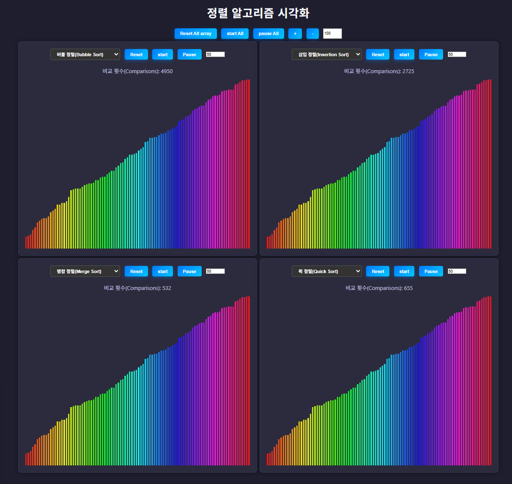

# 🔢 정렬 알고리즘 시각화기 (Sorting Algorithm Visualizer)

이 프로젝트는 **React + TypeScript**로 개발된 정렬 알고리즘 시각화 애플리케이션입니다.  
여러 개의 `visualizer(이하 시각화기)`를 동시에 생성하여 다양한 정렬 알고리즘이 작동하는 과정을 단계별로 관찰할 수 있습니다.

  
[정렬 알고리즘 시각화 페이지 링크](https://uisin.net/dev/react-sort)  
[개발 서버 링크](https://uisin.net/dev/)

## ✨ 주요 기능

### 사용법  
1. 원하는 만큼 시각화기를 생성
2. 각 시각화기에 대해 원하는 정렬을 선택
3. 개별 버튼으로 시작하거나, 통합 버튼으로 `동일한 배열`을 정렬하여 비교 가능

- 📊 다양한 정렬 알고리즘 시각화:
  - 버블 정렬 (Bubble Sort)
  - 삽입 정렬 (Insertion Sort)
  - 병합 정렬 (Merge Sort)
  - 퀵 정렬 (Quick Sort)
  - 선택 정렬 (Selection Sort)
- ➕ 시각화기를 여러 개 추가하거나 제거 가능
- 🔁 모든 시각화기에 대해 전체 시작, 초기화, 일시정지 기능 제공
- 🔢 정렬에 사용할 배열 크기 커스텀 가능
- 당연히 모든 visualizer는 각각 커스텀 가능

## 🧩 사용 기술

- React
- TypeScript
- CSS

### 설치 및 실행

```sh
git clone https://github.com/risekus/react-sort.git
cd react-sort
npm install
npm start
